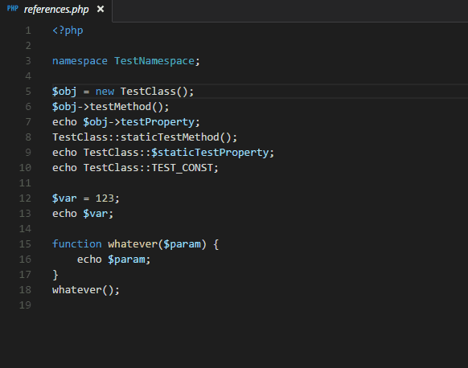

# Dayside Codeintel

[](./LICENSE) 


Codeintel support for dayside

Python based [Dayside](https://github.com/boomyjee/dayside) plugin for autocomplete.  

## Features
- python, javascript and php support
- imports autocomplete - shows autocomplete with the available modules/symbols in real-time   


- jump to symbol definition - jump to the file and line of the definition of a symbol


## Install
Connect the plugin to dayside as usual. See example
```html
<!-- connect dayside script -->
<script src="client/dayside.js"></script>
<link href="client/dayside.css" rel="stylesheet" type="text/css">

<!-- connect codeintel script -->
<script src="<plugin_folder>/client/codeintel.js"></script>
<link href="<plugin_folder>/client/codeintel.css" rel="stylesheet" type="text/css">

<script>
    // run dayside
    dayside({
        //...dayside options
    });
    // run codeintel plugin
    dayside.plugins.codeintel({
        port: 4200 // port where backend server should start, default 8000
    });
</script>
```

### License

Plugin is [MIT licensed](./LICENSE).
